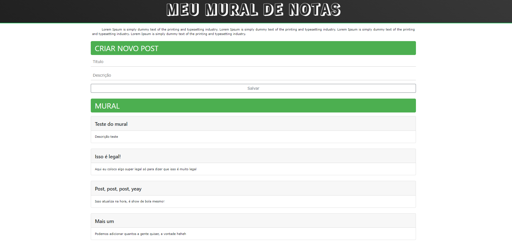
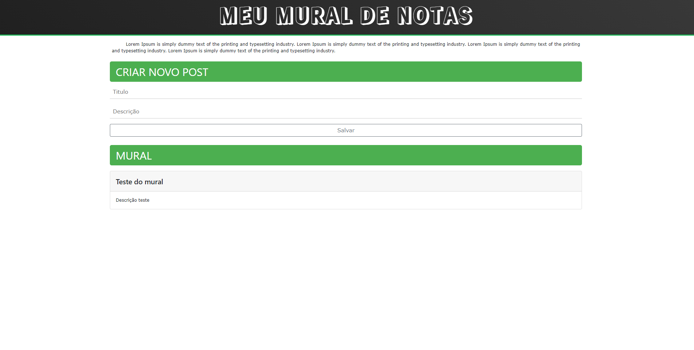
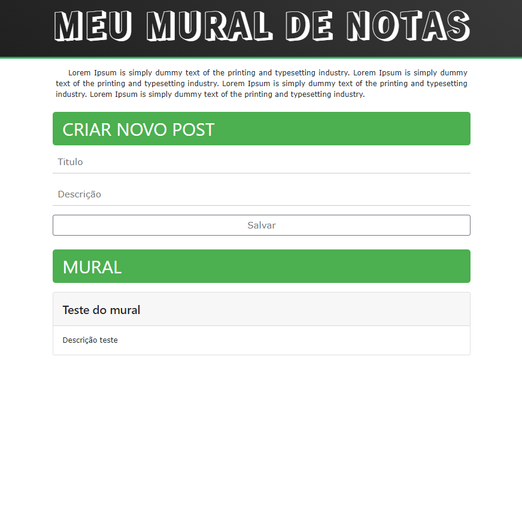

<h2 align="center">
  Aplicação Web Mural de Notas
</h2>

<p align="center">
 <a href="#-sobre-o-projeto">Sobre</a> •
 <a href="#-tecnologias">Tecnologias</a> •
 <a href="#-site">Site</a> • 
 <a href="#-responsivo">Responsivo</a> • 
 <a href="#-como-executar">Executar</a> 
</p>

## 💻 Sobre o projeto

É uma aplicação web que serve de mural de notas. Basicamente, você tem uma página principal com um formulário na qual você pode usar colocar um título e uma descrição para
uma nota e adicionar na tela. Em baixo, tem todas as notas adicionadas. O projeto ele tem integração entre o back-end e o front-end para o processamento das requisições, além
de ser responsivo e tem armazenamento localstorage.

---

## 🛠 Tecnologias

As seguintes ferramentas foram usadas na construção do projeto:

-   **HTML5**
-   **CSS3**
-   -    **Bootstrap** (w3)
-   **JavaScript**
-   **Node.Js**
-   -    **Express**
-   -    **Router**
-   -    **BodyParser**
-   **Insomnia** (Para testar a API)

## 🚀 Site

<p align="center">
  
</p>

## 🚀 Responsivo

<p align="center">
  
  
</p>

---

## 🛠 COMO EXECUTAR

Basta baixar os arquivos e depois seguir as intruções: 

```bash

# Clone este repositório
$ git clone git@github.com:KaiqueBM/Mural-De-Notas.git

# Acesse a pasta do projeto no terminal/cmd
$ cd endereço/Mural-De-notas

# Instale as dependências
$ npm install

# Execute a aplicação em modo de desenvolvimento
$ node index.js

# O servidor inciará na porta:3333 - acesse http://localhost:3333 

```

